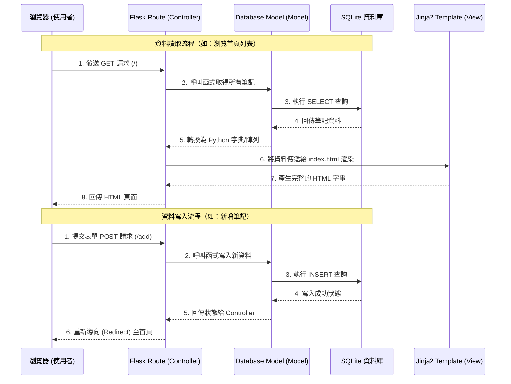

# 讀書筆記本 (Book Notes) - 系統架構文件

本文件根據產品需求文件（PRD）設計「讀書筆記本」系統的技術架構與資料夾結構。

## 1. 技術架構說明

本系統採用傳統的後端渲染架構（Server-Side Rendering），不進行前後端分離，以確保開發速度與降低系統複雜度。

- **後端框架：Python + Flask**
  - **原因**：Flask 是輕量級框架，非常適合快速建置小型應用與原型。
- **模板引擎：Jinja2**
  - **原因**：Flask 內建 Jinja2，能直接在後端將資料注入 HTML 並渲染頁面，實作動態網頁最為直接。
- **資料庫：SQLite**
  - **原因**：無需額外安裝資料庫伺服器，資料儲存於本地單一檔案（`.db`），非常適合個人筆記本或小型 MVP 專案。

### Flask 的 MVC 模式應用
雖然 Flask 本身沒有強制的 MVC 規範，但我們將依循 MVC（Model-View-Controller）精神來組織程式碼：
- **Model（模型）**：負責與 SQLite 資料庫互動，定義資料表結構與存取邏輯。
- **View（視圖）**：由 Jinja2 與 HTML/CSS 負責，呈現畫面給使用者。
- **Controller（控制器）**：由 Flask 的 Routes（路由）負責，接收使用者的 Request，呼叫 Model 取得/更新資料，然後把資料傳遞給 View 渲染畫面。

## 2. 專案資料夾結構

以下為建議的專案目錄結構，將不同職責的程式碼分開，以便於後續維護：

```text
web_app_development2/
├── app/
│   ├── __init__.py        # 初始化 Flask 應用程式
│   ├── models/            # (Model) 資料庫模型與操作
│   │   └── book.py        # 定義書籍筆記的資料庫存取邏輯
│   ├── routes/            # (Controller) 路由設定與業務邏輯
│   │   └── book_routes.py # 處理新增、編輯、刪除、搜尋等請求
│   ├── templates/         # (View) Jinja2 HTML 模板
│   │   ├── base.html      # 共用版型（導覽列、頁尾等）
│   │   ├── index.html     # 首頁（筆記列表與搜尋結果）
│   │   └── form.html      # 新增與編輯共用的筆記表單
│   └── static/            # 靜態資源檔案
│       ├── css/
│       │   └── style.css  # 自訂樣式
│       └── js/            # 若有需要的前端互動指令碼
├── instance/
│   └── database.db        # SQLite 資料庫檔案
├── docs/                  # 專案文件
│   ├── PRD.md             # 產品需求文件
│   └── ARCHITECTURE.md    # 系統架構文件 (本文件)
├── app.py                 # 應用程式進入點，負責啟動伺服器
└── requirements.txt       # Python 套件相依清單
```

## 3. 元件關係圖

以下展示使用者與系統互動時，資料與畫面的流向：



## 4. 關鍵設計決策

1. **採用模組化的架構設計**
   - **決策**：將主程式分為 `app.py` 與 `app/` 資料夾（內含 models、routes 等子目錄）。
   - **原因**：比起將所有程式碼塞在一個檔案裡，這樣拆分可以大幅提高程式碼的可讀性，未來如果專案擴充也能輕鬆維護。
2. **共用 HTML 版型 (`base.html`)**
   - **決策**：利用 Jinja2 的模板繼承（Template Inheritance）功能。
   - **原因**：導覽列和載入 CSS 的 `<head>` 區塊在每一頁都一樣。使用 `base.html` 可確保所有頁面風格一致，且修改導覽列只需更動一個檔案。
3. **單一資料表架構**
   - **決策**：針對目前的 MVP，我們將書名、心得、星級、留言全部設計在一個資料庫表中。
   - **原因**：目前的資料關聯性單純，不需要拆分多個表進行 Join 查詢，如此可保持查詢效能最佳化，同時讓新手開發過程更為順暢。
4. **共用表單模板**
   - **決策**：「新增筆記」與「編輯筆記」將共用同一個 `form.html` 模板。
   - **原因**：兩者的欄位完全一致，透過 Jinja2 判斷變數（是否有傳入既有資料）即可決定要顯示空白表單還是填好資料的表單，減少重複撰寫 HTML 的心力。
