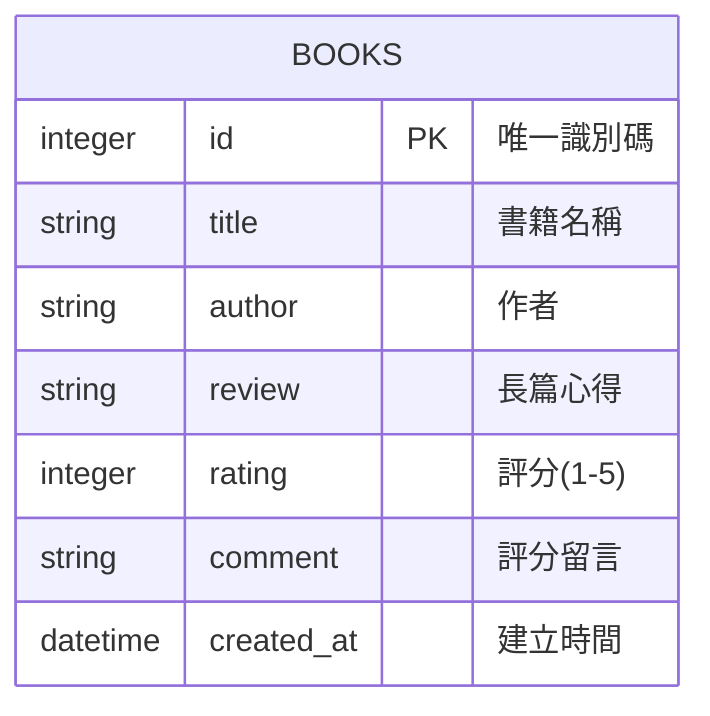

# 讀書筆記本 (Book Notes) - 資料庫設計文件

本文件描述系統的 SQLite 資料庫結構，包含 ER 圖、欄位說明以及建表語法。

## 1. ER 圖（實體關係圖）

目前系統作為 MVP，所有資料都儲存在單一的 `books` 資料表中，沒有複雜的關聯設計。

## 2. 資料表詳細說明

### `books` 資料表 (書籍筆記)

儲存使用者每一本閱讀過的書籍、心得及評分紀錄。

| 欄位名稱 | 型別 | 必填 | 預設值 | 說明 |
| :--- | :--- | :--- | :--- | :--- |
| `id` | INTEGER | 是 | (Auto Increment) | Primary Key，每筆紀錄的唯一編號 |
| `title` | TEXT | 是 | 無 | 書籍名稱 |
| `author` | TEXT | 否 | NULL | 作者（雖然 PRD 中未強制要求，但加入此欄位可讓紀錄更完整） |
| `review` | TEXT | 否 | NULL | 閱讀後的心得長文 |
| `rating` | INTEGER | 是 | 0 | 對該書的評分，通常為 1-5 之間的數字 |
| `comment` | TEXT | 否 | NULL | 針對評分的簡短留言註解 |
| `created_at`| DATETIME| 是 | CURRENT_TIMESTAMP | 該筆記建立的時間 |

## 3. SQL 建表語法

請參考專案中的 `database/schema.sql` 檔案。

## 4. Python Model 程式碼

我們使用內建的 `sqlite3` 套件來操作資料庫。封裝好的 Model 程式碼位於 `app/models/book.py` 中，包含以下核心方法：
- `create(title, author, review, rating, comment)`: 新增筆記
- `get_all()`: 取得所有筆記
- `get_by_id(book_id)`: 取得單一筆記
- `update(book_id, title, author, review, rating, comment)`: 更新筆記
- `delete(book_id)`: 刪除筆記
- `search(keyword)`: 關鍵字搜尋書名或心得
