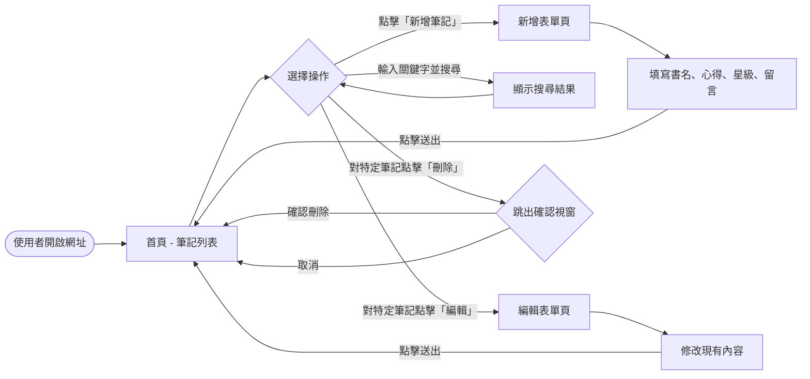
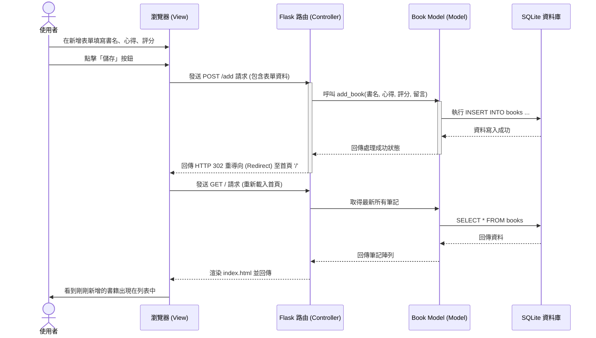

# 讀書筆記本 (Book Notes) - 流程圖文件

本文件根據 PRD 與架構設計，將「讀書筆記本」系統的使用者操作路徑與後端資料流視覺化，確保開發前所有邏輯無遺漏。

## 1. 使用者流程圖（User Flow）

此流程圖展示了使用者進入網站後，可以進行的各種操作與頁面跳轉邏輯。

## 2. 系統序列圖（Sequence Diagram）

以下序列圖以「**使用者新增書籍筆記**」為例，展示從前端到後端資料庫的完整互動流程。

## 3. 功能清單對照表

在正式進入 API 與路由設計前，先粗略盤點各個功能對應的 URL 路徑與 HTTP 方法，為下一階段的開發作準備：

| 功能名稱 | 對應 URL 路徑 | HTTP 方法 | 說明 |
| :--- | :--- | :--- | :--- |
| **瀏覽首頁 (列表)** | `/` | GET | 顯示所有書籍筆記（支援帶入搜尋參數） |
| **新增筆記 (顯示表單)** | `/add` | GET | 回傳空白的新增表單 HTML |
| **新增筆記 (送出資料)** | `/add` | POST | 接收表單資料並寫入資料庫 |
| **編輯筆記 (顯示表單)** | `/edit/<id>` | GET | 根據筆記 ID，回傳填好舊資料的表單 HTML |
| **編輯筆記 (送出資料)** | `/edit/<id>` | POST | 接收修改後的表單資料並更新資料庫 |
| **刪除筆記** | `/delete/<id>` | POST | 根據筆記 ID 刪除該筆資料 |
